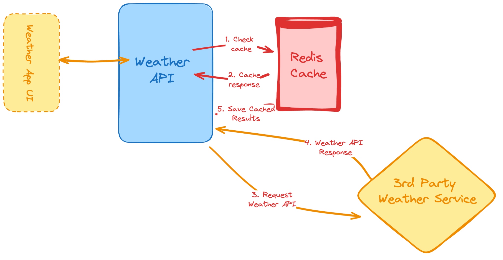

# Weather API

This is a challenge project from [Roadmap.sh](https://roadmap.sh/projects/weather-api-wrapper-service).

## Overview
A simple Weather API service that fetches weather data from external providers and caches responses using Redis for improved performance. This project is designed as a learning exercise to demonstrate API design, caching strategies, and integration with third-party services.

## Architecture Diagram


## Features
- Fetch current weather data for a given location
- Cache weather responses in Redis to reduce API calls
- Configurable cache expiration
- Simple RESTful API interface
- **Rate limiting:** Each IP is limited to 5 requests per minute (burst up to 2). Exceeding this returns a 429 Too Many Requests error.

## Tech Stack
- Go (Golang)
- Redis
- (Optional) Docker
- (Optional) External Weather API (e.g., OpenWeatherMap, WeatherAPI)

## Setup
1. **Clone the repository:**
   ```sh
   git clone <repo-url>
   cd weather-api-redis
   ```
2. **Install dependencies:**
   ```sh
   # If using Go modules
   go mod tidy
   ```
3. **Set up environment variables:**
   Create a `.env` file in the root directory with your OpenWeatherMap API key:
   ```
   OPENWEATHERMAP_API_KEY={YOUR_API_KEY}
   ```
   > **Note:** Replace `{YOUR_API_KEY}` with your actual OpenWeatherMap API key. You can get a free API key from [OpenWeatherMap](https://openweathermap.org/api).

4. **Run Redis (required for caching):**
   ```sh
   docker run --name weather-redis -p 6379:6379 -d redis
   ```
   > **Note:** Redis is required for the caching feature to work. The API will still function without Redis, but caching will be disabled.

5. **Run the API server:**
   ```sh
   go run main.go
   ```
   The server will start on port 8080 by default. You can set the `PORT` environment variable to change the port.

> **Note:** Redis caching is now implemented. The codebase is structured to allow easy integration of Redis in the future.

## Usage

### Get Current Weather

**Endpoint:** `GET /weather`

**Parameters:**
- `location` (required): City name or location to get weather for

**Example Request:**
```bash
curl "http://localhost:8080/weather?location=London"
```

**Example Response (Success):**
```json
{
  "data": {
    "location": "London",
    "temperature": 15.2,
    "description": "clear sky",
    "cached": false
  },
  "message": "Success"
}
```

**Response Fields:**
- `data`: The weather data object (see below)
  - `location`: The city name returned by the weather API
  - `temperature`: Temperature in Celsius
  - `description`: Weather description (e.g., "clear sky", "rain", "clouds")
  - `cached`: Boolean indicating if the response was served from cache (`true`) or fetched fresh from the API (`false`)
- `message`: Response status message (e.g., "Success")
- `error`: Error message (only present if an error occurred)

**Example Error Response (Missing location parameter):**
```json
{
  "error": "Missing 'location' query parameter",
  "message": "Error"
}
```

**Example Error Response (Invalid location or API error):**
```json
{
  "error": "Failed to fetch weather data",
  "message": "Error"
}
```

**Example Error Response (Invalid HTTP Method):**
```
HTTP/1.1 405 Method Not Allowed
Allow: GET
Content-Type: application/json

{
  "error": "Method not allowed",
  "message": "Error"
}
```

**Example Error Response: Rate Limiting**

If a client exceeds the allowed rate, the API responds with:

```
HTTP/1.1 429 Too Many Requests
Content-Type: application/json

{
  "message": "Too Many Requests",
  "error": "rate limit exceeded"
}
```

**Testing Caching:**
1. First request for a location will return `"cached": false`
2. Subsequent requests within 10 minutes will return `"cached": true`
3. After 10 minutes, the cache expires and a fresh API call is made

**Example with Postman:**
- Method: `GET`
- URL: `http://localhost:8080/weather?location=Tokyo`
- Headers: None required